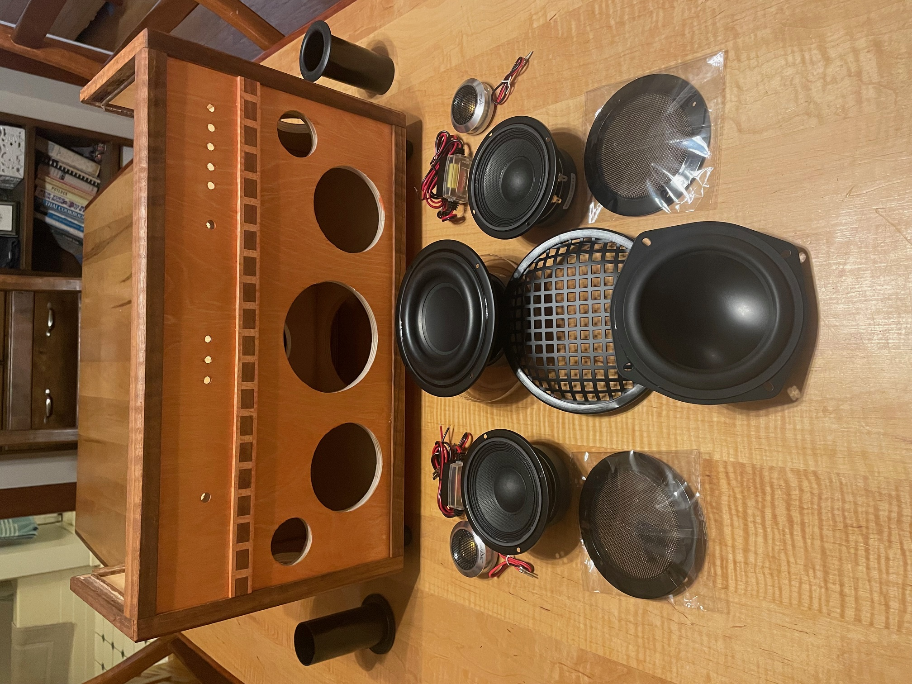
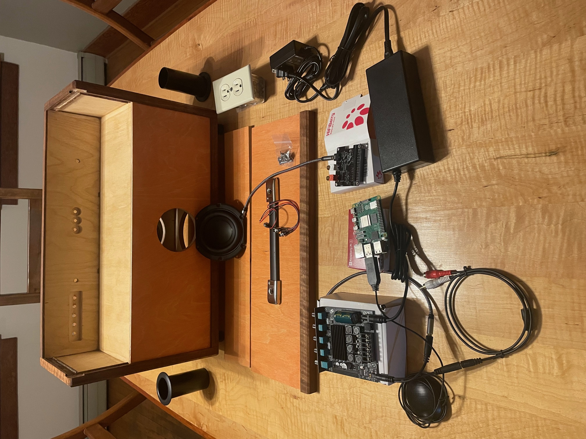
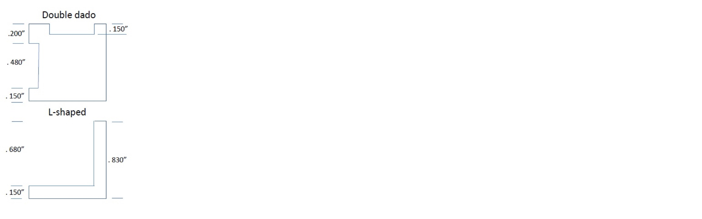
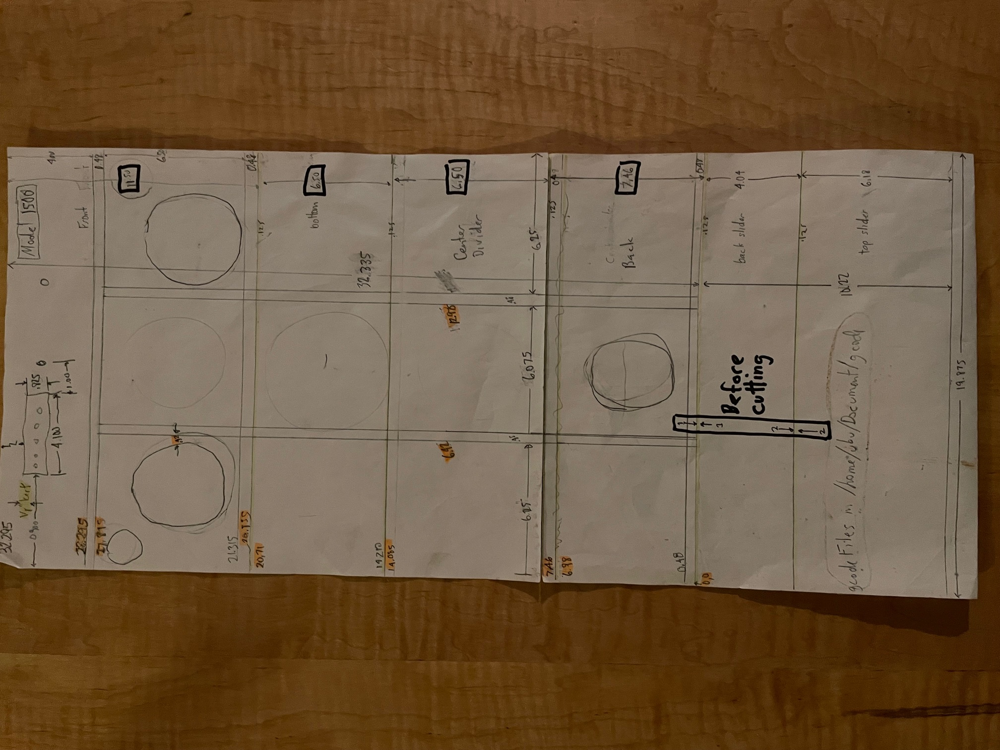
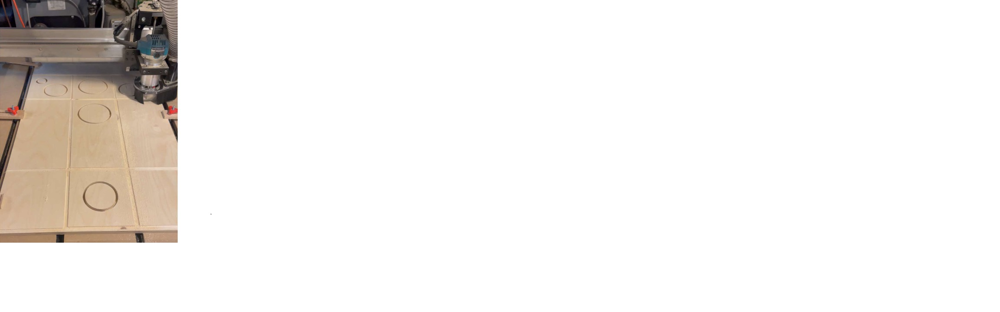
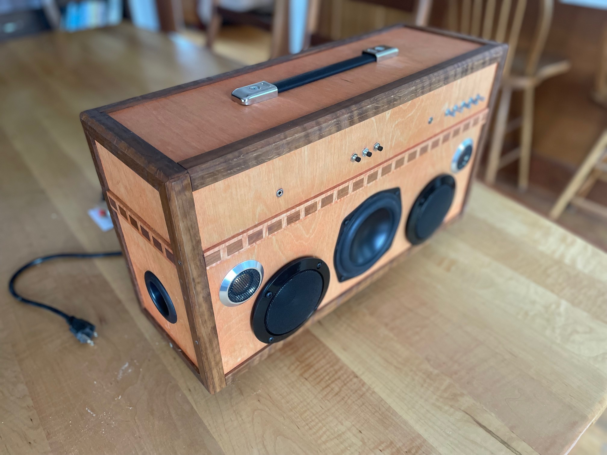
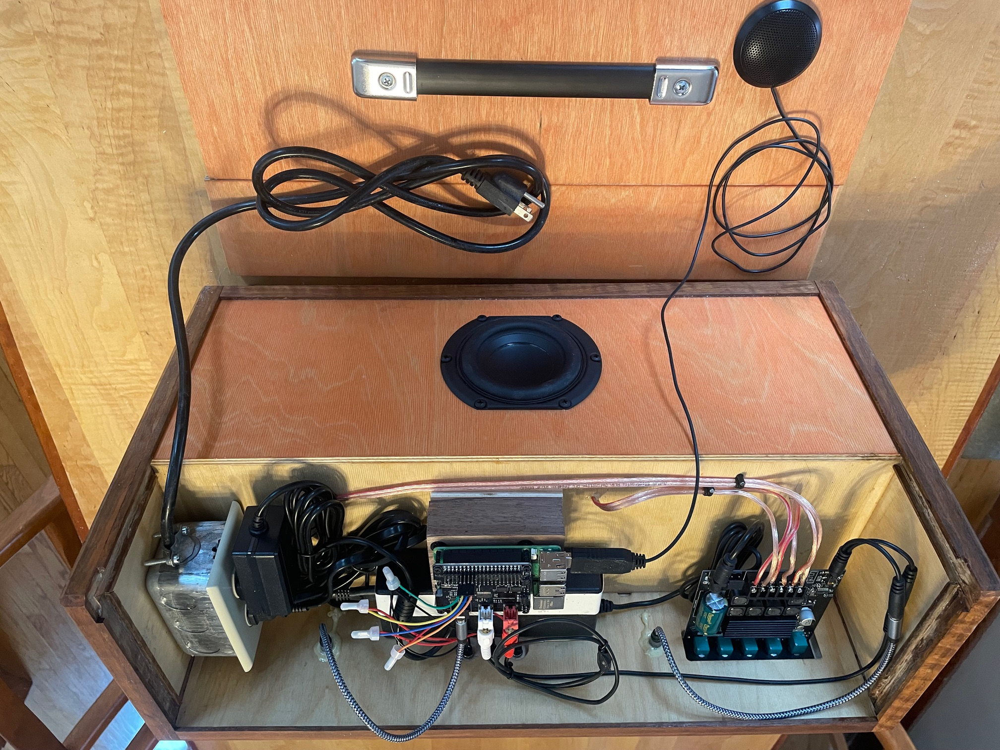

# Overview of a smart boombox
The goal of this project is to create a retro-looking boombox that sounds amazing and can play music by voice. 

This section gives an overview and [Building a smart boombox](#building-a-smart-boombox) gives all the detailed steps.

The picture below shows the front of a boombox carcass assembled and finished, but with no components installed. 
It has three enclosures at the bottom for the left speakers, subwoofer, and right speakers. 
The top third houses the amp, the Raspberry Pi computer and all other components. 
Two removable panels allow easy access to the components. 

It is constructed of 1/2" Baltic birch plywood with hardwood edge moldings. 
The decorative molding in the front is curly maple with cherry inlay. 
The subwoofer is in a sealed enclosure and  *down firing* while the other 5-1/4" device in front is a *passive radiator* - a 
speaker with no electronics. There is also a smaller passive radiator on the back, so the subwoofer 
is driving itself and two other *speakers*. The left and right enclosures are ported. They each have a 4" mid-range speaker 
and 1" tweeter. *Crossover networks* come with the tweeters, so no soldering is required. 
The tweeters really do bring out the highs when compared with “full range drivers”, and of course, the subwoofer 
and friends really bring out the bass.  The left and right enclosures are ported with 1-3/4" diameter ports seen on the sides. 
The subwoofer and mid-ranges are protected with grills, while the passive radiators are unprotected because 
they’re the cheapest to replace and they look kinda cool naked.

There is a 3.5mm headphone jack on the left, and an *aux in* jack on the right. 

Baltic birch has little grain and color, and it just seemed too plain with clear stain. 
An orange stain was tested, but it was too bright and gaudy. Mixing the stain with 
about four parts water turned it into an “orange-wash”, which adds color, brings out the grain, but 
is not overwhelming. After staining, two or three coats of Tung Oil are applied, with sanding between each coat. 


*Front view of boombox carcass and parts*

The next picture shows an amp on the left, a RasPi 5 and a Hifiberry “DAC HAT” to greatly 
improve the audio. Two power supplies are needed: 24V for the amp and 5V for the computer; thus 
the need for an electrical outlet. On the left is a USB microphone. In the center are three 
pushbuttons for previous track, stop/pause, and next track. The amp has an on/off/volume control 
on the right, treble and bass controls in the middle, and subwoofer volume and cutoff frequency 
on the left. You can Bluetooth directly to the amp and bypass the computer.


*Back view of boombox carcass and parts*

# Building a smart boombox
This repo contains the G-Code to build a smart boombox using a CNC machine. 

To build the boombox, perform the following steps: 

- [Obtain all parts and components](#obtain-all-parts-and-components)
- [Download the G-code](#download-the-g-code)
- [Prepare for assembly](#prepare-for-assembly)
- [Perform final assembly](#perform-final-assembly)
- [Install components](#install-components)
- [Stand up the software stack](#stand-up-the-software-stack)

## Obtain all parts and components 
Obtain the follow parts and components:

- [Plywood panels](plywood-panels)
- [Hardwood pieces](#hardwood-pieces)
- [Components](#components)

### Plywood panels
Following are the 1/2" Baltic birch plywood pieces. The nominal thickness is 0.480". 

| Description                 | Qty | Size |
| -----------                 | --- | ---- |
| Main panel                  | 1   | 19.875" x 32.295" |
| Side panels                 | 2   | 6.005" x 11.875" |
| Internal enclosure dividers | 2   | 6.375" x 6.875" **TODO** verify numbers |

The main panel is cut on the CNC machine using two different jobs because the panel is longer than the maximum capacity of 30".
Later it is cut into four panels: the front, the bottom, the lower back and the internal horizontal divider.

### Hardwood pieces 
All hardwood moldings are 0.830" x 0.830". Almost any hardwood can be used. One other piece of wood is needed.

| Description               | Qty | Size |
| -----------               | --- | ---- |
| Side tops and bottoms     | 4   | 7.385" |
| Side fronts and backs     | 4   | 11.875" |
| Front and back L moldings | 4   | ~20" (each will be cut to size later) |
| Raspberry Pi platform     | 1   | 2.75" x 3.625" |

One other piece is a *platform* used to elevate the Raspberry Pi. The thickness must be slightly taller than the power supply for proper access to the Raspberry Pi's power and display ports. Usually 1-1/4" thick is enough, but not always - measure the big power supply you have.

Following is a diagram of the side moldings (*Double dado*) and the L-shaped moldings


*Cross section of the two moldings*

### Components  
Following are the components needed, the cost (in Jan 2024) and the source where they were purchased.

| Description                                  | Cost | Source/use |
| -----------                                  | ---- | ---------- |
| Raspberry Pi 5: 8GB RAM                      | $80  | www.seeedstudio.com/Raspberry-Pi-5-8GB-p-5810.html |
| RasPi power supply: CanaKit 5V, 3.5A         | $10  | www.amazon.com/gp/product/B01DID1TG4 |
| DAC HAT: Hifiberry DAC2 Pro                  | $45  | www.hifiberry.com/shop/boards/hifiberry-dac2-pro/ |
| MicroSD card: Sandisk 64GB                   |  $7  | www.amazon.com/gp/product/B07XDCZ9J3 |
| 2.1 amplifier: Damgoo 50/50/100W             | $26  | www.amazon.com/gp/product/B089KT3FG9 |
| Amp power supply 24V, 5A: Alitove            | $20  | www.amazon.com/gp/product/B0865LS8XB |
| Pair midrange speakers: Eminence 4"          | $50  | www.parts-express.com/Eminence-Alpha-4-8-4-Full-Range-Pair-8-Ohm-290-4012 |
| Pair tweeters: Skar Audio 1", 320W           | $53  | www.amazon.com/gp/product/B01DID1TG4 |
| Subwoofer: Tang Band 5-1/4"                  | $50  | www.parts-express.com/Tang-Band-W5-1138SMF-5-1-4-Paper-Cone-Subwoofer-Speaker-264-917 |
| Front passive radiator: Dayton Audio 5-1/4"  | $14  | www.parts-express.com/Dayton-Audio-ND140-PR-5-1-4-Aluminum-Cone-Passive-Radiator-290-217 |
| Back passive radiator: Peerless 3-1/2"       |  $8  | www.parts-express.com/Peerless-830878-3-1-2-Passive-Radiator-264-1060 |
| L&R speaker ports: 1-3/4" x 4"               |  $2  | www.parts-express.com/Port-Tube-1-3-4-ID-x-4-L-260-407 |
| 2 3.5mm male to female: Tan Audio 1Ft        | $12  | www.amazon.com/gp/product/B087CLK6Q5 |
| 2 RCA to 3.5mm cable: 3Ft                    |  $2  | www.parts-express.com/2-RCA-Male-to-3.5mm-Stereo-Male-Y-Adapter-Cable-with-Gold-Plated-Connectors-3-ft.-240-1018
| 3.5mm Y cable: Parts Express                 |  $2  | www.parts-express.com/3.5mm-Stereo-Male-to-Two-3.5mm-Stereo-Female-Y-Adapter-Cable-with-Gold-Plated-Connectors-3-240-1026 |
| Handle: Penn-Elcomm Wide Strap               |  $6  | www.parts-express.com/Penn-Elcom-H1014K-Extra-Wide-Strap-Handle-Black-End-Caps-262-314 |
| Subwoofer Grill: 6"                          |  $4  | www.parts-express.com/6-Economy-Speaker-Grill-260-371 |
| pushbuttons: DaierTek Normally Open 10 pack  | $10  | www.amazon.com/gp/product/B09C8C53DM |
| Female to Female jumper wires: GenBasic      |  $6  | www.amazon.com/gp/product/B077N58HFK |
| Pair speaker grills: Facmogu 4"              |  $9  | www.amazon.com/gp/product/B077N58HFK |
| Rubber feet: 4-pk, 1" x 1.25"                |  $2  | www.parts-express.com/4-Pack-Rubber-Cabinet-Feet-1-Dia.-x-1.25-H-260-7515|
| Power cord, 10', 18-3 wire                   |  $4  | www.parts-express.com/6-ft.-Power-Cord-Black-18-3-110-100 |
| USB microphone                               | $20? | many choices |
| Electrical box, outlet, connector and cover  | $10? | hardware store |
| 10 flat-head 1-1/2" stainless steel screws   | ?    | for sides and top |
| 4 flat-head 1-1/2" black screws              | ?    | for Raspberry Pi |
| 1/2", 3/4" and 1" black pan-head screws      | ?    | for speakers |
| Double stick tape                            | ?    | for crossover networks |

80+10+45+7+26+20+50+53+14+9+2+12+2+2+6+4+10+6+2+4+20+10=394

An estimate of the cost of the components is $394. Adding in wood and expendibles the price tag is around $450-500.

## Download the G-code
G-code is to a CNC machine what object code is to a computer. It tells the machine what to do, and the machine (hopefully) does it.  
This assumes the wood is the exact same size and aligned in the exact same place.

Because the panel is over 30" (max of my CNC machines), it must be cut twice, rotate 180 degrees between jobs.  
After is the main panel jobs, it is cut on the tablesaw to create four pieces: the front, the bottom, the back and enclosure divider. 

The following G-code files in this repo are used on a CNC machine to cut out all the pieces.

| G-code file       | Size   | Description |
| -----------       | ----   | -----------
| 4PanelsMainJob.nc | 19.875" wide x 32.295" high | Most cuts on the main panel  |
| faceUpsideDown.nc | 19.875" wide x 32.295" high | Remaining cuts on the top face with panel rotated 180 degrees |
| leftSide.nc       | 7.386" wide x 11.875" high| Cuts on the assembled left side |
| righttSide.nc     | 7.386" wide x 11.875" high| Cuts on the assembled right side |

If you don't have a CNC machine, all of the cuts can be done on a table saw with dado blades.

## Prepare for assembly 
Final assembly of the carcass can take place when you have:
- Four panels cut from the machined main panel
- Two sliding panels and two enclosure dividers
- Two sides assembled and cut with CNC jobs

To accomplish this, perform the following tasks:
- [Cut the main panel](*cut-the-main-panel)
- [Prepare all panels](*prepare-all-panels)
- [Drill holes on face](*drill-holes-on-face)
- [Construct two sides](*construct-two-sides)

### Cut the main panel
The distance between each of the 5 knobs on the amplifier is 0.720" in the CNC job.  Before running the job, verify that is true on the amp in hand.

Consider the following rough drawing:


*Rough drawing of main panel and two sliding panels*

Following are the steps to cut the main panel.
- Cut a sheet of Baltic birch into three 19.875" pieces. There should be almost no refuse.
- Mark a "1" and a "2" at 32.395" and 36.56: (32.395" + 0.125" + 4.04").  This will allow you align the grain properly on all panels. 
Note the **Before cutting** square in black in the picture.
  - **TODO:** Get a better drawing of the main panel.
- Cut a piece 32.395". This is the "main panel" which will later be cut into four pieces. The two "1" marks should be cut in half.
  - **NOTE:** This value assumes a kerf of 0.125" which is common for table saw blades.  Some thin kerf blades are below 0.100", so you may have to reduce the 32.395" accordingly.
- Load the Gcode ``4PanelsMainJob.nc``.
- Clamp and square the main panel. 
- Zero XYZ of the main panel.
- Load and run the job to cut the majority of the main panel.
- **Before removing the panel from the clamps**, verify the dados are wide enough to fit the plywood!
- Rotate the piece 180 degrees and run the job ``faceUpsideDown.nc``, again squaring and zeroing the piece.  This will cut the holes and recesses at the top of the front panel. 

This picture shows the main panel being cut by a CNC machine.


*Main panel being cut*

### Prepare all panels
To prepare the panels, perform the following tasks:
- Starting from the top of the main panel working down, cut the 4 machined panels:
  - Top - 11.500"
  - Bottom and center divider - both 6.500"
  - Back - 7.460" (ideally that will be exactly what you are left with)
- Cut the sliding panels, noting the mark to align the boards so the grain is continuous.
  - Back slider - 4.040" - The two "2" marks should be cut in half.
  - Top slider - 6.180"
- Cut the 2 enclosure dividers - 6.250" x 6.750" (**TODO:** verify these numbers)
- Cut the 2 sides - 6.005" x 11.875". 

You should now have 10 pieces of plywood:
- 4 milled panels to be glued together
- 2 enclosure dividers to be glued inside the carcass
- 2 panels that will be sliding covers
- 2 sides 

### Drill holes on face 
The second CNC job on the main panel prepared 10 holes to be drilled from the front, for the amp, buttons and jacks,
as well as two cavities for the amplifier and the 3 buttons to go in.

Baltic birch plywood is subject to tearout.  To avoid that as much as possible, perform the following steps:
- Put masking tape on the front covering all 10 holes.
- Drill 10 pilot holes from the back in the center of each hole with a 1/16" bit.
- Drill holes in the front with sharp Forstner bits:
  - 2 holes for jacks:   11/32 (0.344")
  - 3 holes for buttons:  9/32 (0.281") 
  - 5 holes for amp:     19/64 (0.297") 

### Construct two sides
There are CNC jobs for the glued up left and right sides which accomplish this function:
- Cut a hole for the plastic port.
- Cut the outside molding so the sliding panels can be inserted.
- Cut most of the inside thin molding inside the carcass.  
This step was added because it was extremely difficult to get the sides and carcass to align perfectly.

To construct the sides, perform the following tasks:
- Cut 4 *double dado* moldings to 11.875" and 4 to 7.385", all with 45 degree angles so they go together like a picture frame.
- Arrange the two sides **ensuring there are left and right sides**. Leave the pieces in those positions. 
- Glue each side up without altering the left and right side arrangement.
- Run the CNC job ``leftSide.nc`` on the left side.
- Run the CNC job ``rightSide.nc`` on the right side.
- Sand the sides, especially the inside edges which will not be easily accessible after they are glued to the carcass.

**TODO** get a picture
 
## Perform final assembly 
To perform the final assembly of all wood pieces, perform the following tasks:
- [Glue carcass](#glue-carcass)
- [Glue sides to carcass](#glue-sides-to-carcass)
- [Glue L-shaped moldings](#glue-l-shaped-moldings)
- [Finish sliding panels](#finish-sliding-panels)

### Glue carcass 
To glue up the main carcass, perform the following tasks:
- Dry fit the four machined panels and two enclosure dividers.
- Glue the two enclosure dividers to the bottom and center divider and clamp with 2 clamps.
- Glue the side with no clamps to the front panel.
- Remove the 2 clamps and glue the back panel on.
- Add perhaps 4 clamps to lightly clamp all 6 pieces.
- Use 2 right-angle clamps at the left and right sides to ensure the box is square.
- Add many more clamps to ensure tight joints all around.
- Allow to dry.

**TODO** Get a picture of this

### Glue sides to carcass 
To glue the sides to the main carcass, perform the following tasks:
- Dry fit the sides on.
- Glue the sides on, clamping with 5 24" clamps.
- Allow to dry.
- Screw 4 1-1/2" stainless steel screws through each side into carcass. 

**TODO** Get a picture of this

### Glue L-shaped moldings
You should have four L-shaped moldings, each greater than 20".

To attach the L-shaped moldings to the box, perform the following tasks:
- Slide the top slider on, but not the back slider, so it cannot be glued to the top.
- Cut one piece to the length of the top-back.  This will be the longest piece.
- Cut the other 3 pieces to size so they fit tightly.
- Glue the 4 moldings onto the carcass and clamp. The long molding will be glued to the top sliding panel.  
- Allow to dry.
- Drill holes and screw 2 1-1/2" stainelss steel screws through the top sliding panel molding into the back sliding panel.  
This will ensure the boombox stays together when being carried. 

**TODO** Get a picture of this

### Finish sliding panels 
Ideally, the sliding panels will fit and slide perfectly.  
- Screw in the handle, centered on the top panel.  
The location of the screws should be midway between the slots on the metal insert, so the handle is not too tight, 
nor does it open up too far when the boombox is being carried.
- Use a piece of candle to wax the channels that the panels slide in, and the ends of the panels.

## Install components 
To install all components, perform the following tasks:
- [Install electrical outlet](*install-electrical-outlet)
- [Install amplifier power supply](*install-amplifier-power-supply)
- [Install Raspberry Pi and DAC](*install-raspberry-pi-and-dac)
- [Partially install speakers](*partially-install-speakers)
- [Connect and test amplifier](*connect-and-test-amplifier)
- [Finish installing speakers](*finish-installing-speakers)
- [Install pushbuttons](*install-pushbuttons)
- [Install remaining components](*install-remaining-components)

### Install electrical outlet
To install the electrical outlet, perform the following tasks:
- Attach a Romex connector to the bottom of the electrical box.
- Rest the outlet on a small piece of plywood about 0.400" thick on the right side of the boombox.  
This will raise it up so the cover will fit.
- Place the outlet 0.750" away from the front panel.  This will leave enough room in the back to stow the main power cord.
- Run the power cord through the Romex connector and attach it to the outlet
- Screw the electrical box into the side of the boombox.
- Screw the outlet into the electrical box.
- Put the cover plate on the outlet.

### Install amplifier power supply
To install the amplifier power supply, perform the following tasks:
- Get a piece of about 1" wide aluminum flashing about 2" longer the the width of the power supply, plus two sides.
- Make 4 folds so the flashing extends about 1" on either side of the power supply.
- Attach this strap with 1/2" screws to the power supply centered under the buttons and touching the front panel.

### Install Raspberry Pi and DAC 
To install the Raspberry Pi and DAC HAT, perform the following tasks:
- Carefully drill out the 4 holes in the corners of the RasPi so that the screws will fit through.
- Put heat sinks on all 4 chips on the Raspberry Pi.
- Plug the DAC HAT onto the Raspberry Pi, making certain that the pins are aligned.
- Attach the wooden platform with 2 2" screws behind the amp's power supply.
- Procure 4 standoffs about 0.125" and 2 about 0.430" that the screws will fit through.
- Drill 4 1/16" pilot holes.
- Put the small standoffs over the pilot holes.
- Put the RasPi/DAC HAT on the 4 standoffs, and put the 2 standoffs on the side opposite the GPIO pins.
- Screw the unit to the platform with 4 thin 1-1/2" black screws.  
The connectors on the left should be proud of the platform so it is easy to insert and remove cables and peripherals.

### Partially install speakers 
To partially install the two midrange speakers, two tweeters, and subwoofer, perform the following tasks:
- Cut 3 pieces of 16 guage speaker wire to the following lengths:
  - 20": right speaker
  - 26": subwoofer 
  - 34": left speaker
- Drill 3 holes, each 7/32" (0.219") each 1-3/4" from the back of the boombox into each enclosure.
- Run the wires to the enclosures.
- On the wire to the subwoofer, attach a narrow female spade connector to the negative side and a wide connector to the positive side, and attach to the subwoofer. 
- In the left and right enclosures, perform the following tasks:
  - Attach the short wire from the crossover to the tweeters.
  - Cut the long wire to 12" and strip the insulation.
  - Using double-stick tape, fasten the crossover units to the bottom, nearest the subwoofer enclosure.
  - Prepare a 6" jumper, stripped on one end and wide female spade connectors on the other and attach it to the midrange speaker.
  - Attach the speaker wire, the crossover network and the midrange speaker together with a crimp.

Leave three speakers resting in front of their enclosures for a test.

### Connect and test amplifier
To connect the amplifier and test it, perform the following tasks:
- Strip about 1/2" of insulation off the three speaker wire pairs. 
- Twist the copper strands and attach the 6 wires to the amp using the wiring guide provided. 
**NOTE**: tinning the wires makes them too wide to fit.
- Plug the amp's power supply into the socket. 
- Plug the boombox into the wall.
- Test the amp and be sure all five speakers are working. 

### Finish installing speakers   
Polyester fiber stuffing slows down sound waves inside the box, making the subwoofer perform as if the box were bigger. 

To finish installing the speakers, perform the following tasks:
- Put polyester fiber in the subwoofer enclosure from both sides of the passive radiator openings.
- Use 4 black 3/4" screws, with large heads, to fasten both the subwoofer grill and the subwoofer.
- Attach the two passive radiators on the front and back with 1/2" screws. 
- Seal the holes where the wires go into the enclosures with polyurethane glue.

### Install pushbuttons 
Following are the GPIO pins on a Raspberry Pi with pin 1 being on the left side and inside of the Pi:
```
       3V3  (1)  (2)  5V
     GPIO2  (3)  (4)  5V
     GPIO3  (5)  (6)  GND
     GPIO4  (7)  (8)  GPIO14
       GND  (9)! (10) GPIO15
    GPIO17 (11)! (12) GPIO18
    GPIO27 (13)! (14) GND
    GPIO22 (15)! (16) GPIO23
       3V3 (17)  (18) GPIO24
    GPIO10 (19)  (20) GND
     GPIO9 (21)  (22) GPIO25
    GPIO11 (23)  (24) GPIO8
       GND (25)  (26) GPIO7
     GPIO0 (27)  (28) GPIO1
     GPIO5 (29)  (30) GND
     GPIO6 (31)  (32) GPIO12
    GPIO13 (33)  (34) GND
    GPIO19 (35)  (36) GPIO16
    GPIO26 (37)  (38) GPIO20
       GND (39)  (40) GPIO21
```
To install the three pushbuttons, perform the following tasks:
- Cut 4 GPIO pin jumpers to their maximum length of about 3".
- Solder the 3 black wires and one of the jumpers together.  This will be the ground.
- Solder the other 3 jumpers to the red wire of each button.
- Fasten the 3 buttons on the face using a nutdriver or socket to tighten the nuts. 
- Attach the ground wire to pin 9.
- Attach the previous track, pause/resume, and next track jumpers to pins 11, 13 and 15.

### Glue the jacks to the face.
To glue the jacks to the face, perform the following tasks:

- Protecting the face with boards on the sides, place the boombox face down.
- Insert the two 3.5mm female jacks into the 2 holes not in cavities.
- Use polyurethane glue on the back side of the panel to attach the jacks, so the glue cannot bubble out the front.
- Allow the glue to dry.

### Install remaining components 
To install , perform the following tasks:
- Attach the male end of the headphone jack to the headphone amp on the HifiBerry DAC.
- With the RCA to 3.5mm male adapter, attach the RCA jacks to the the HifiBerry DAC 
- With the 3.5mm Y-cable, attach the Aux-in male to one side and RCA to 3.5mm male to the other.
- Attach the male of the Y-cable into the amplifier.
- Plug the Raspberry Pi power supply in the outlet.
- Attach the USB-C end of the power supply to the left side of the Raspberry Pi. 
**TODO:** Add picture.

## Stand up the software stack 
Installing the software is outside the scope of this document, but here's a short answer.
- Plug a monitor, keyboard and mouse into the Raspberry Pi.
**TODO:** Add picture.
- Flash a Linux to a micro-SD card and plug it in to the Raspberry Pi.
- Power on the RasPi with the new on/off button. 

# The finished product
Below is one completed boombox.


*Smart boombox front view*


*Under the hood*

